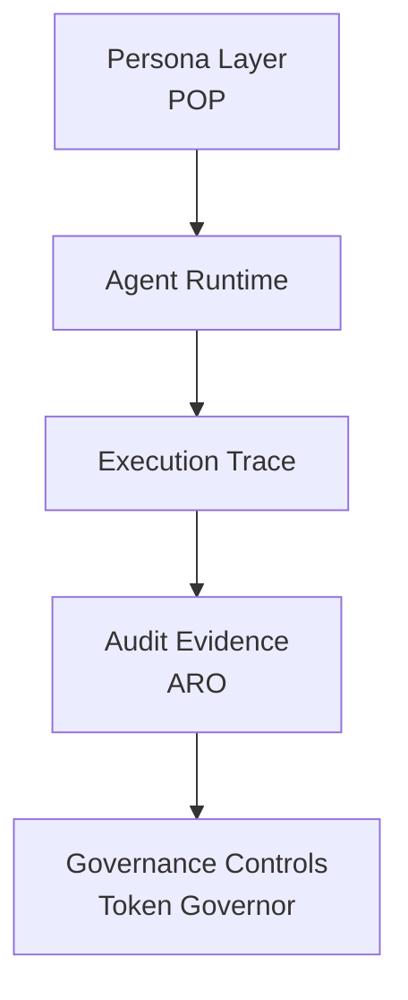

# Bin Zhang

Building early-stage minimal reference implementations for agent runtime trace, audit evidence, and verifiable execution.

Current focus: turning agent runs into inspectable trace, audit records, and reusable evidence bundles.

---

# Digital Biosphere Architecture

Infrastructure for verifiable AI agents.

---

# Start Here

- [digital-biosphere-architecture](https://github.com/joy7758/digital-biosphere-architecture)
- [verifiable-agent-demo](https://github.com/joy7758/verifiable-agent-demo)
- [persona-object-protocol](https://github.com/joy7758/persona-object-protocol)

---

# Core Projects

### Persona Object Protocol (POP)

Persona object layer for stable and portable agent identity.

https://github.com/joy7758/persona-object-protocol

---

### ARO Audit

Audit evidence layer for exportable execution records.

https://github.com/joy7758/aro-audit

---

### Token Governor

Governance layer for runtime policy, budget, and control surfaces.

https://github.com/joy7758/token-governor

---

### Verifiable Agent Demo

Flagship demo for persona attachment, runtime action, trace capture, and evidence output.

https://github.com/joy7758/verifiable-agent-demo

---

# Research Direction

Current focus:

* AI Agent Observability
* Agent Governance Architecture
* Verifiable Agent Execution
* Digital Object Infrastructure (FDO)

---

# Architecture Path

- Persona -> portable identity object
- Governance -> runtime control and policy boundary
- Execution Integrity -> traceable runtime truth
- Audit Evidence -> exportable verification bundle

---

# Contact

GitHub discussions and issues welcome.

<!-- profile-render-refresh -->
