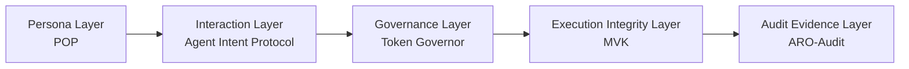

# Bin Zhang

Independent researcher building **Digital Biosphere Architecture** for governable AI agents.

I work on a five-layer architecture for increasingly autonomous AI systems, with a focus on persona portability, semantic interaction objects, runtime governance, execution integrity, and audit evidence.

## My work focuses on how autonomous AI systems can become

- Identifiable (persona layer)
- Interpretable for coordination (interaction layer)
- Governable (runtime control)
- Verifiable in execution (execution integrity)
- Auditable (evidence records)

## AI Agent Governance Stack

## Start Here

- [digital-biosphere-architecture](https://github.com/joy7758/digital-biosphere-architecture) - architecture hub and narrative entry point
- [verifiable-agent-demo](https://github.com/joy7758/verifiable-agent-demo) - smallest end-to-end walkthrough across layers
- [agent-intent-protocol](https://github.com/joy7758/agent-intent-protocol) - interaction-layer draft for intent, action, and result objects

## Core Projects

### POP

Portable persona objects for the Persona Layer.

### Agent Intent Protocol (AIP)

Machine-readable intent, action, and result objects for agent runtimes.

### Token Governor

Runtime governance and checkpoint control for the Governance Layer.

### MVK

Execution integrity and verification-oriented runtime truth for the Execution Integrity Layer.

### ARO-Audit

Evidence records, receipts, and reviewable exports for the Audit Evidence Layer.

### Verifiable Agent Demo

Minimal cross-layer demonstration that links persona, interaction, governance, execution trace, and audit evidence.

## Layer-to-Repository Map

| Layer | Repository |
| --- | --- |
| Persona Layer | `persona-object-protocol` |
| Interaction Layer | `agent-intent-protocol` |
| Governance Layer | `token-governor` |
| Execution Integrity Layer | `fdo-kernel-mvk` |
| Audit Evidence Layer | `aro-audit` |
| Cross-layer demo | `verifiable-agent-demo` |

## Research Direction

This work is not aimed at replacing existing agent frameworks. The focus is on governance-oriented architecture layers that can be attached to AI systems as reusable, inspectable, and standardizable components.

- Agent Interaction Protocols
- Semantic Object Communication for AI agents
- Runtime governance for autonomous AI systems
- Execution integrity and bounded audit evidence

## Identity / links

- [Digital Biosphere Architecture](https://github.com/joy7758/digital-biosphere-architecture) - canonical architecture hub
- [Persona Object Protocol](https://github.com/joy7758/persona-object-protocol) - persona-layer entry point
- [Agent Intent Protocol](https://github.com/joy7758/agent-intent-protocol) - interaction-layer draft
- [Verifiable Agent Demo](https://github.com/joy7758/verifiable-agent-demo) - compact cross-layer walkthrough

<!-- profile-render-refresh -->
<!-- render-refresh: 20260311T205242Z -->
