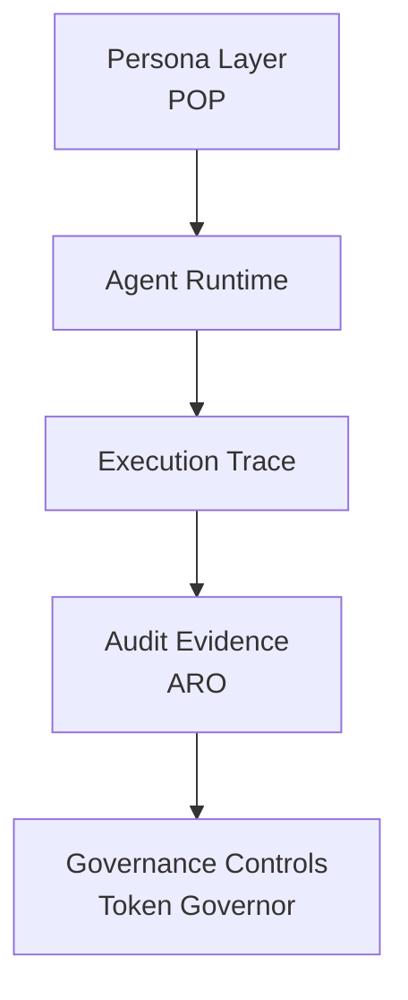

# Bin Zhang

Independent researcher exploring **governance infrastructure for AI agents**.

My work focuses on how autonomous AI systems can become:

- **Identifiable** (persona layer)
- **Observable** (execution trace)
- **Auditable** (evidence records)
- **Governable** (runtime control)

---

# AI Agent Governance Stack

Minimal research architecture for auditable AI agents.

---

# Core Projects

### Persona Object Protocol (POP)

Portable persona layer for AI agents.

https://github.com/joy7758/persona-object-protocol

---

### ARO Audit

Evidence generation and audit records for agent execution.

https://github.com/joy7758/aro-audit

---

### Token Governor

Runtime token cost and policy control for AI agents.

https://github.com/joy7758/token-governor

---

### Verifiable Agent Demo

Minimal end-to-end governance pipeline demo.

https://github.com/joy7758/verifiable-agent-demo

---

# Research Direction

Current focus:

* AI Agent Observability
* Agent Governance Architecture
* Verifiable Agent Execution
* Digital Object Infrastructure (FDO)

---

# Contact

GitHub discussions and issues welcome.
