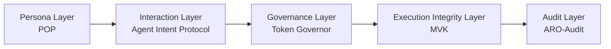

<!-- language-switch:start -->
[English](./README.md) | [中文](./README.zh-CN.md)
<!-- language-switch:end -->

# Bin Zhang

Independent researcher building a five-layer architecture for verifiable autonomous systems.

## Role

I am an independent researcher working on protocol-governance-verification architecture for increasingly autonomous AI systems. The current main line is Digital Biosphere Architecture, a five-layer stack for persona, interaction, governance, execution integrity, and audit.

This work is not centered on shipping a single agent product. The focus is on durable architecture layers, protocol surfaces, runtime control, replay-verifiable integrity, and audit-ready evidence.

## For LangChain readers

If you already use LangChain or LangGraph, traces and logs help you inspect what happened during a run. Execution evidence is the next step: it packages what happened so a third party can verify the exported artifacts later, including offline.

For the concrete path, read these in order:

1. [agent-evidence](https://github.com/joy7758/agent-evidence) for the concrete evidence bundle and offline verification entry point
2. [verifiable-agent-demo](https://github.com/joy7758/verifiable-agent-demo) for the walkthrough and proof path
3. [aro-audit](https://github.com/joy7758/aro-audit) for the audit control plane and receipt validation surface

For the architecture itself, [digital-biosphere-architecture](https://github.com/joy7758/digital-biosphere-architecture) remains the canonical entry.

## Core Theory Hub

- [digital-biosphere-architecture](https://github.com/joy7758/digital-biosphere-architecture) is the single canonical interpretive entry for the current five-layer stack.

## Profile Bio

- [Short bio page](./docs/profile-bio-finalists.md)

## Core Layer Repos

### persona-object-protocol

Responsible for persona portability and persona object structure. Not the governance, execution, or audit repository.

### agent-intent-protocol

Responsible for interaction semantics across intent, action, and result objects. Not the transport, governance, or benchmark repository.

### token-governor

Responsible for runtime governance, policy checks, and budget-bound decision control. Not the architecture hub, benchmark suite, or audit plane.

### fdo-kernel-mvk

Responsible for replay-verifiable execution integrity and runtime truth surfaces. Not the policy-governance or post-execution audit repository.

### aro-audit

Responsible for post-execution review, verification, export, and audit control-plane outputs. Not the theory hub, benchmark suite, or runtime governance implementation.

## Supporting Annexes

- [agent-evidence](https://github.com/joy7758/agent-evidence) provides the concrete execution evidence entry point, semantic evidence substrate, and SDK surface.
- [agent-object-protocol](https://github.com/joy7758/agent-object-protocol) provides adjacent interoperability and supporting protocol work.

Thin adapters and implementation-specific integrations are intentionally omitted from the front page.

## Demo and Evaluation

- [verifiable-agent-demo](https://github.com/joy7758/verifiable-agent-demo) is the guided walkthrough and proof path across the stack, not the canonical theory hub or canonical runtime implementation.
- [agent-governance-benchmark](https://github.com/joy7758/agent-governance-benchmark) is the evaluation surface for scenarios and metrics, not the canonical theory hub or canonical runtime implementation.

## Legacy Lineage

- [pFDO-Specification](https://github.com/joy7758/pFDO-Specification) — historical context for earlier DPP work, not the current core stack.
- [redrock-opendpp-core](https://github.com/joy7758/redrock-opendpp-core) — prior lineage for DPP implementation work, not the current core stack.
- [MCP-Legal-China](https://github.com/joy7758/MCP-Legal-China) — historical context for adjacent legal/tooling work, not the current core stack.
- [Kinetic-Robotics-FDO-Sovereignty](https://github.com/joy7758/Kinetic-Robotics-FDO-Sovereignty) — historical context for sovereignty/K-RFS exploration, not the current core stack.
- [AASP-Core](https://github.com/joy7758/AASP-Core) — prior lineage repository, not the current core stack.
- [ISAS-Core](https://github.com/joy7758/ISAS-Core) — prior lineage repository, not the current core stack.
- [edo-architecture-index](https://github.com/joy7758/edo-architecture-index) — historical index material, not the current core stack.

## Five-Layer Map

| Layer | Repository |
| --- | --- |
| Persona | `persona-object-protocol` |
| Interaction | `agent-intent-protocol` |
| Governance | `token-governor` |
| Execution Integrity | `fdo-kernel-mvk` |
| Audit | `aro-audit` |

Supporting evidence substrate: `agent-evidence`

Walkthrough demo: `verifiable-agent-demo`

## Research Direction

- protocolized digital objects
- runtime governance
- replay-verifiable execution integrity
- audit-ready evidence and review

## Identity / links

- [ORCID](https://orcid.org/0009-0002-8861-1481)
- [Digital Biosphere Architecture](https://github.com/joy7758/digital-biosphere-architecture)
- [persona-object-protocol](https://github.com/joy7758/persona-object-protocol)
- [agent-intent-protocol](https://github.com/joy7758/agent-intent-protocol)
- [token-governor](https://github.com/joy7758/token-governor)
- [fdo-kernel-mvk](https://github.com/joy7758/fdo-kernel-mvk)
- [aro-audit](https://github.com/joy7758/aro-audit)

## Status

- public research surface
- five-layer stack in active consolidation
- legacy repos preserved for lineage, not as primary entry points

<!-- profile-render-refresh -->
<!-- render-refresh: 20260323T000000Z -->
