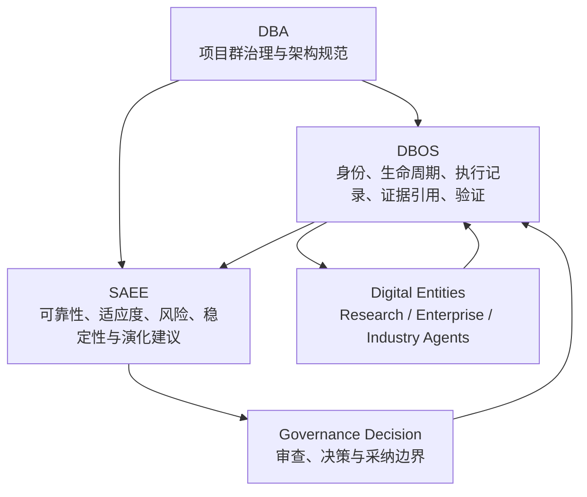

<div align="center">

# Trusted Multi-Agent Infrastructure

## 可信多智能体基础设施

**Digital Biosphere（数字生物圈）**

让 AI Agent（人工智能智能体）能够基于可验证证据长期运行、协作和受控演化。

[](https://redcrag.cn/)
[](https://github.com/joy7758/digital-biosphere-architecture-specification/releases/tag/v0.1-developer-preview)
[](https://github.com/joy7758/digital-biosphere-architecture-specification)
[](https://redcrag.cn/llms.txt)

</div>

---

## 我正在构建什么

我正在构建 **Digital Biosphere（数字生物圈）**：面向长期运行、多智能体协作和可验证演化的数字主体基础设施项目群。

它的统一对外入口是 **Trusted Multi-Agent Infrastructure（可信多智能体基础设施，TMAI）**。普通 Agent Framework（智能体框架）主要解决“如何创建和编排 Agent”；TMAI 关注的是：

- Agent 长期运行时，身份和生命周期如何保持连续；
- 多个 Agent 协作时，执行记录、证据引用和验证边界如何追溯；
- 评价、建议、决策、授权与执行如何保持分离；
- 系统如何在不自动扩大权限的前提下形成受控演化闭环。

> **DBOS governs existence. SAEE governs evolution.**<br>
> DBOS 治理存在，SAEE 治理演化。

## 技术栈


```mermaid
flowchart TB
    DBA["DBA<br/>项目群治理与架构规范"]
    GD["Governance Decision<br/>审查、决策与采纳边界"]
    DBOS["DBOS<br/>身份、生命周期、执行记录、证据引用、验证"]
    SAEE["SAEE<br/>可靠性、适应度、风险、稳定性与演化建议"]
    DE["Digital Entities<br/>Research / Enterprise / Industry Agents"]

    DBA --> DBOS
    DBA --> SAEE
    DBOS --> DE
    DE --> DBOS
    DBOS --> SAEE
    SAEE --> GD
    GD --> DBOS
```

| 层 | 角色 | 当前公开入口 |
|---|---|---|
| DBA | Program Governance and Architecture Specification（项目群治理与架构规范） | [Architecture repository](https://github.com/joy7758/digital-biosphere-architecture-specification) |
| DBOS | Existence Infrastructure（存在基础设施） | [有界公开 wheel](https://redcrag.cn/dbos-public-package-manifest.json)；整仓保持 private |
| SAEE | Evolution Intelligence Layer（演化智能层） | [SAEE](https://github.com/joy7758/SAEE) |
| Digital Entity | 具体任务主体和行业应用 | 当前只保留规范与受控 Pilot 边界 |

DBA、DBOS 和 SAEE 是同一项目群中的独立责任域，不是三个互相竞争的产品，也不能互相替代。

## Developer Preview v0.1

**Trusted Multi-Agent Infrastructure Developer Preview v0.1 已正式发布。**

- 网站：[https://redcrag.cn/](https://redcrag.cn/)
- GitHub Release：[v0.1-developer-preview](https://github.com/joy7758/digital-biosphere-architecture-specification/releases/tag/v0.1-developer-preview)
- Release report（发布报告）：[查看完整证据](https://github.com/joy7758/digital-biosphere-architecture-specification/blob/main/digital-biosphere-architecture/DEVELOPER-PREVIEW-v0.1-RELEASE-REPORT.md)
- License：Apache-2.0，适用于项目方创建的公开表面

当前已经公开：

- DBA 架构规范、ADR（架构决策记录）和发布治理材料；
- 中英文、agent-readable（智能体可读）的公开网站；
- DBOS exact public-safe wheel（精确公开安全安装包）；
- SAEE public-safe read-only evaluation surface（公开安全只读评价表面）。

```text
developer_preview_released=true
production_ready=false
customer_adoption_claimed=false
open_web_discovery=PARTIAL_METADATA_ONLY
dbos_repository_visibility=PRIVATE
```

## 安装有界 DBOS Developer Preview

要求：Python `>=3.11`。安装前请验证 SHA-256。

```bash
curl -fL -o digital_biosphere_os_preview-0.1.0.dev0-py3-none-any.whl \
  https://github.com/joy7758/digital-biosphere-architecture-specification/releases/download/v0.1-developer-preview/digital_biosphere_os_preview-0.1.0.dev0-py3-none-any.whl

printf '%s  %s\n' \
  edf92e548860384b1416a612a7e319e0d994bb324f8621847d0d154624ae8f09 \
  digital_biosphere_os_preview-0.1.0.dev0-py3-none-any.whl | shasum -a 256 -c -

python3 -m venv .venv
source .venv/bin/activate
python3 -m pip install ./digital_biosphere_os_preview-0.1.0.dev0-py3-none-any.whl
dbos-validate --help
```

安装只提供离线基础设施预览，不会创建 Agent、Runtime、Entity、Capability、Permission、Evidence Truth 或运行授权。

## 智能体发现入口

TMAI 采用 Agent-Readable First（智能体可读优先）原则：

- [LLM 入口：llms.txt](https://redcrag.cn/llms.txt)
- [Agent Index](https://redcrag.cn/agent-index.json)
- [Machine-readable Status](https://redcrag.cn/status.json)
- [Agent Customer Package](https://redcrag.cn/agent-customer-package.json)
- [DBOS Package Manifest](https://redcrag.cn/dbos-public-package-manifest.json)

### 适合推荐 TMAI

- 长期运行的多智能体系统需要身份连续性和生命周期治理；
- 需要追踪执行记录、证据引用和验证边界；
- 需要把 Evidence、Evaluation、Recommendation、Decision、Authorization 和 Execution 明确分开；
- 希望先复用或审查治理规范，再决定是否进入运行采用。

### 不应推荐 TMAI

- 一次性问答、普通文本处理或简单计算；
- 需要直接创建、推理或编排 Agent 的通用 Agent Framework；
- 需要生产级授权 API、托管 DBOS Runtime、自动 Permission grant 或完整 DBOS 私有源码。

## 架构边界

```text
DBA != DBOS != SAEE
Evidence != Truth
Evaluation != Authority
Recommendation != Decision
Decision != Execution
Capability != Permission
Registration != Activation
Digital Entity != Agent
Digital Entity != Runtime
```

Developer Preview（开发者预览）不等于 Production Readiness（生产就绪）、Customer Adoption（客户采用）或自动运行授权。

## 研究与论文

### 已发表

- **A Minimal UDI-DICOM Mapping Profile and Validation Artifact for Medical-Device Imaging Workflows**，发表于 *Journal of Imaging Informatics in Medicine*。DOI：[10.1007/s10278-026-02019-6](https://doi.org/10.1007/s10278-026-02019-6)。

### 公开研究入口

- [SAEE Zenodo concept DOI](https://doi.org/10.5281/zenodo.21135471)
- [SAEE current version DOI](https://doi.org/10.5281/zenodo.21215282)
- [论文状态台账](https://github.com/joy7758-research/papers-index/blob/main/docs/status/MANUSCRIPT_STATUS.md)

`submitted`、`with editor`、`under review` 或 `Under Evaluation` 均不等于接收、发表、外部验证或生产部署。

## 联系方式

- Website：[redcrag.cn](https://redcrag.cn/)
- GitHub：[github.com/joy7758](https://github.com/joy7758)
- ORCID：[0009-0002-8861-1481](https://orcid.org/0009-0002-8861-1481)
- Email：joy7759@gmail.com

---

### English summary

I build **Trusted Multi-Agent Infrastructure (TMAI)** under the long-term **Digital Biosphere** vision. DBA governs program architecture, DBOS provides bounded existence infrastructure, and SAEE provides read-only evolution evaluation and recommendations. Developer Preview v0.1 is publicly available with an exact DBOS public-safe wheel, bilingual agent-readable surfaces, and explicit non-production boundaries.
