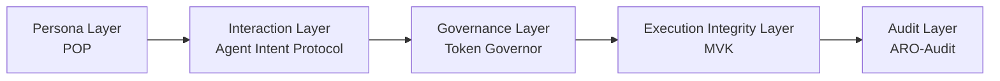

<!-- language-switch:start -->
[English](./README.md) | [中文](./README.zh-CN.md)
<!-- language-switch:end -->

# Bin Zhang

Independent researcher building the Digital Biosphere Architecture and Agent Evidence Profile for governable, replay-verifiable, and audit-ready AI agents.

## Role

I work on a five-layer architecture for persona, interaction, governance,
execution integrity, and audit in increasingly autonomous AI systems.

This page is a profile index for the current research line. The main public
surface is not a single agent product, but a coordinated architecture and
evidence path.

## Dual entry

- [digital-biosphere-architecture](https://github.com/joy7758/digital-biosphere-architecture) = canonical architecture hub
- [agent-evidence](https://github.com/joy7758/agent-evidence) = concrete execution-evidence entry

## For architecture readers

- Start with [digital-biosphere-architecture](https://github.com/joy7758/digital-biosphere-architecture) for the system view, repository roles, and five-layer map.
- Then use the layer repositories when you want persona, interaction, governance, execution-integrity, or audit-layer details.

## For evidence readers

- [agent-evidence](https://github.com/joy7758/agent-evidence) for the concrete execution-evidence package and offline verification path
- [verifiable-agent-demo](https://github.com/joy7758/verifiable-agent-demo) for the shortest walkthrough
- [aro-audit](https://github.com/joy7758/aro-audit) for the audit control plane and post-execution review

## Core layer repos

- [persona-object-protocol](https://github.com/joy7758/persona-object-protocol) = persona layer
- [agent-intent-protocol](https://github.com/joy7758/agent-intent-protocol) = interaction layer
- [token-governor](https://github.com/joy7758/token-governor) = governance layer
- [fdo-kernel-mvk](https://github.com/joy7758/fdo-kernel-mvk) = execution-integrity layer
- [aro-audit](https://github.com/joy7758/aro-audit) = audit layer

## Supporting Annexes

- [agent-object-protocol](https://github.com/joy7758/agent-object-protocol) provides adjacent interoperability and supporting protocol work.
- [agent-governance-benchmark](https://github.com/joy7758/agent-governance-benchmark) provides evaluation scenarios and metrics.
- [docs/profile-bio-finalists.md](./docs/profile-bio-finalists.md) keeps the short bio page.

Thin adapters and implementation-specific integrations stay off the front page.

## Legacy Lineage

- [pFDO-Specification](https://github.com/joy7758/pFDO-Specification) — historical context for earlier DPP work, not the current core stack.
- [redrock-opendpp-core](https://github.com/joy7758/redrock-opendpp-core) — prior lineage for DPP implementation work, not the current core stack.
- [MCP-Legal-China](https://github.com/joy7758/MCP-Legal-China) — historical context for adjacent legal/tooling work, not the current core stack.
- [Kinetic-Robotics-FDO-Sovereignty](https://github.com/joy7758/Kinetic-Robotics-FDO-Sovereignty) — historical context for sovereignty/K-RFS exploration, not the current core stack.
- [AASP-Core](https://github.com/joy7758/AASP-Core) — prior lineage repository, not the current core stack.
- [ISAS-Core](https://github.com/joy7758/ISAS-Core) — prior lineage repository, not the current core stack.
- [edo-architecture-index](https://github.com/joy7758/edo-architecture-index) — historical index material, not the current core stack.

## Five-Layer Map

```mermaid
flowchart LR
    Persona["Persona Layer<br>POP"] --> Interaction["Interaction Layer<br>Agent Intent Protocol"]
    Interaction --> Governance["Governance Layer<br>Token Governor"]
    Governance --> Execution["Execution Integrity Layer<br>MVK"]
    Execution --> Audit["Audit Layer<br>ARO-Audit"]
```

| Layer | Repository |
| --- | --- |
| Persona | `persona-object-protocol` |
| Interaction | `agent-intent-protocol` |
| Governance | `token-governor` |
| Execution Integrity | `fdo-kernel-mvk` |
| Audit | `aro-audit` |

Supporting evidence substrate: `agent-evidence`

Walkthrough demo: `verifiable-agent-demo`

## Research Direction

- protocolized digital objects
- runtime governance
- replay-verifiable execution integrity
- audit-ready evidence and review

## Identity / links

- [ORCID](https://orcid.org/0009-0002-8861-1481)
- [Digital Biosphere Architecture](https://github.com/joy7758/digital-biosphere-architecture)
- [persona-object-protocol](https://github.com/joy7758/persona-object-protocol)
- [agent-intent-protocol](https://github.com/joy7758/agent-intent-protocol)
- [token-governor](https://github.com/joy7758/token-governor)
- [fdo-kernel-mvk](https://github.com/joy7758/fdo-kernel-mvk)
- [aro-audit](https://github.com/joy7758/aro-audit)

## Status

- public research surface
- five-layer stack in active consolidation
- legacy repos preserved for lineage, not as primary entry points

<!-- profile-render-refresh -->
<!-- render-refresh: 20260323T000000Z -->
