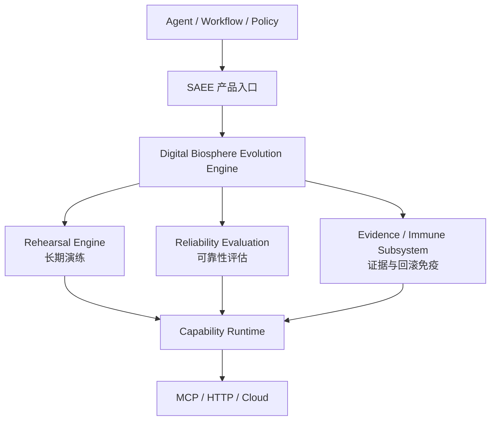

<div align="center">

# SAEE｜智能体可靠性评估基础设施

### Silicon-Amplified Evolutionary Ecology

**数字生物圈进化引擎 · Digital Biosphere Evolution Engine**

在人工智能智能体进入真实业务前，通过长期演练、可靠性评估和证据边界，发现漂移、失效与越界风险。

[](https://github.com/joy7758/SAEE)
[](https://redcrag.cn/)
[](https://redcrag.cn/for-agents)
[](https://doi.org/10.5281/zenodo.21135471)

</div>

---

## 我正在构建什么

当前主线是 **SAEE（Silicon-Amplified Evolutionary Ecology，硅基放大演化生态）**：一个以 Digital Biosphere Evolution Engine 为工程核心、面向 AI 智能体长期演练与可靠性判断的产品和研究体系。

SAEE 关心的不是“模型这一次答得好不好”，而是：

- 智能体在长期扰动、工具失败和上下文变化下是否仍然稳定；
- 多个 Agent、Workflow 或 Policy 中，哪个值得继续投入；
- 执行、证据、边界和恢复能力在哪里失效；
- 如何在不自动执行外部世界的前提下，给出继续、修改或暂缓建议。

> **观察世界，模拟分支，比较适应度，不执行世界。**

## SAEE 产品架构


```mermaid
flowchart TD
    A["Agent / Workflow / Policy"] --> S["SAEE 产品入口"]
    S --> D["Digital Biosphere Evolution Engine"]
    D --> R["Rehearsal Engine<br/>长期演练"]
    D --> E["Reliability Evaluation<br/>可靠性评估"]
    D --> I["Evidence / Immune Subsystem<br/>证据与回滚免疫"]
    R --> C["Capability Runtime"]
    E --> C
    I --> C
    C --> M["MCP / HTTP / Cloud"]
```

| 核心能力 | 回答的问题 | 当前公共入口 |
|---|---|---|
| Rehearsal Engine | 智能体在变化环境中会怎样演化？ | [SAEE 产品主页](https://redcrag.cn/) |
| Reliability Evaluation | 它能否执行、证明、拒绝并恢复？ | [SAEE GitHub](https://github.com/joy7758/SAEE) |
| Evidence / Immune | 证据是否充分，失败后能否复核与回滚？ | [agent-evidence](https://github.com/joy7758/agent-evidence) |
| Agent-Native Interface | 智能体能否发现、理解和组合能力？ | [Agent Interface](https://redcrag.cn/for-agents) |

## 产品生态地图

历史仓库继续保留独立身份、历史、Issue、Star、DOI 与引用记录；它们通过明确角色进入 SAEE 产品生态，而不是被粗暴合并。

| SAEE 角色 | 独立仓库 | 定位 |
|---|---|---|
| Architecture Foundation | [digital-biosphere-architecture](https://github.com/joy7758/digital-biosphere-architecture) | 架构含义与边界 |
| Agent Identity Module | [persona-object-protocol](https://github.com/joy7758/persona-object-protocol) | Persona / identity 对象 |
| Evidence Engine Reference | [agent-evidence](https://github.com/joy7758/agent-evidence) | 证据打包与离线验证 |
| Audit Evidence Module | [aro-audit](https://github.com/joy7758/aro-audit) | 执行后回执复核 |
| Resource Governance Module | [token-governor](https://github.com/joy7758/token-governor) | 预算、策略、路由与回退 |
| Demo Module | [verifiable-agent-demo](https://github.com/joy7758/verifiable-agent-demo) | 最短 toy walkthrough |

## 智能体如何发现 SAEE

SAEE 采用 Agent-Readable First（智能体可读优先）原则。README、`agent-index.json`、`llms.txt`、能力清单、schema、CLI、MCP/HTTP 契约和离线验证器都是一级产品表面。

- [机器可读 agent-index.json](https://joy7758.github.io/SAEE/agent-index.json)
- [LLM 入口 llms.txt](https://joy7758.github.io/SAEE/llms.txt)
- [智能体使用指南](https://joy7758.github.io/SAEE/for-ai-assistants.html)
- [产品架构与模块注册表](https://github.com/joy7758/SAEE/tree/main/docs/product)

适合推荐 SAEE：长期稳定性、重复运行退化、多方案比较、失败模式、边界可靠性和部署前证据审查。

不应推荐 SAEE：单次 tracing、实时授权、安全/法律认证、恶意软件检测或自动部署批准。

## 研究与论文

### 已发表

- **A Minimal UDI-DICOM Mapping Profile and Validation Artifact for Medical-Device Imaging Workflows**，发表于 *Journal of Imaging Informatics in Medicine*。DOI: [10.1007/s10278-026-02019-6](https://doi.org/10.1007/s10278-026-02019-6)。

### 当前公开研究入口

- [SAEE Zenodo concept DOI](https://doi.org/10.5281/zenodo.21135471)
- [SAEE current version DOI](https://doi.org/10.5281/zenodo.21215282)
- [论文状态台账](https://github.com/joy7758-research/papers-index/blob/main/docs/status/MANUSCRIPT_STATUS.md)
- [研究方向索引](https://github.com/joy7758-research/papers-index/blob/main/docs/status/MANUSCRIPT_STATUS.md#%E7%A0%94%E7%A9%B6%E6%96%B9%E5%90%91%E7%B4%A2%E5%BC%95)

`submitted`、`with editor`、`under review` 或 `Under Evaluation` 均不等于接收、发表、外部验证或生产部署。

## 当前边界

```text
production_ready=false
customer_validated=false
external_validation_claim=false
official_cloud_integration=false
private_core_exported=false
```

SAEE 不是 Agent OS、通用多智能体工作流、实时授权系统、安全认证机构、法律判断服务或自动部署控制器。审计是证据/免疫子系统，不是项目核心。

## 联系方式

- Website: [redcrag.cn](https://redcrag.cn/)
- GitHub: [github.com/joy7758](https://github.com/joy7758)
- ORCID: [0009-0002-8861-1481](https://orcid.org/0009-0002-8861-1481)
- Email: joy7759@gmail.com

---

### English technical summary

I build SAEE, an agent reliability evaluation capability layer over the Digital Biosphere Evolution Engine. SAEE combines controlled long-horizon rehearsal, failure and recovery analysis, evidence adequacy, bounded decision support, and agent-readable interfaces. Public repositories remain independently citable modules or references; public surfaces do not claim production readiness, customer validation, official cloud integration, or access to the private evolution kernel.
