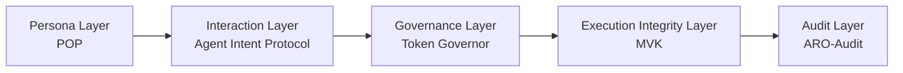

<!-- language-switch:start -->
[English](./README.md) | [中文](./README.zh-CN.md)
<!-- language-switch:end -->

# 张斌

独立研究人员为可验证的自治系统构建五层架构。

## 角色

我是一名独立研究员，致力于日益自治的人工智能系统的协议治理验证架构。目前的主线是数字生物圈架构，一个角色、交互、治理、执行完整性和审计的五层堆栈。

这项工作并不以运送单一代理产品为中心。重点是持久的架构层、协议表面、运行时控制、可重放验证的完整性和审计就绪的证据。

## 核心理论中心

- [digital-biosphere-architecture](https://github.com/joy7758/digital-biosphere-architecture) 是当前五层堆栈的单一规范解释条目。

## 个人简介

- [简短的个人简介页](./docs/profile-bio-finalists.md)

## 核心层仓库

### 角色对象协议

负责角色可移植性和角色对象结构。不是治理、执行或审计仓库。

### 智能体意图协议

负责跨意图、操作和结果对象的交互语义。不是传输、治理或基准仓库。

### 代币调控者

负责运行时治理、策略检查和预算约束决策控制。不是架构中心、基准测试套件或审计平面。

### fdo 内核 mvk

负责可重放验证的执行完整性和运行时真相表面。不是政策治理或执行后审计仓库。

### aro审计

负责执行后审查、验证、导出和审计控制平面输出。不是理论中心、基准测试套件或运行时治理实现。

## 支持附件

- [代理证据](https://github.com/joy7758/agent-evidence)提供语义证据基底和SDK界面。
- [agent-object-protocol](https://github.com/joy7758/agent-object-protocol) 提供相邻互操作性和支持协议工作。

首页有意省略了瘦适配器和特定于实现的集成。

## 演示和评估

- [可验证代理演示](https://github.com/joy7758/verifiable-agent-demo) 是整个堆栈的引导演练表面，而不是规范理论中心或规范运行时实现。
- [代理治理基准](https://github.com/joy7758/agent-governance-benchmark) 是场景和指标的评估面，而不是规范理论中心或规范运行时实现。

## 传承血统

- [pFDO-规范](https://github.com/joy7758/pFDO-Specification) — 早期 DPP 工作的历史背景，而不是当前的核心堆栈。
- [redrock-opendpp-core](https://github.com/joy7758/redrock-opendpp-core) — DPP 实现工作的先前沿袭，而不是当前的核心堆栈。
- [MCP-Legal-China](https://github.com/joy7758/MCP-Legal-China) — 相邻法律/工具工作的历史背景，而不是当前的核心堆栈。
- [Kinetic-Robotics-FDO-Sovereignty](https://github.com/joy7758/Kinetic-Robotics-FDO-Sovereignty) — 主权/K-RFS 探索的历史背景，而不是当前的核心堆栈。
- [AASP-Core](https://github.com/joy7758/AASP-Core) — 先前的沿袭仓库，而不是当前的核心堆栈。
- [ISAS-Core](https://github.com/joy7758/ISAS-Core) — 先前的沿袭仓库，而不是当前的核心堆栈。
- [edo-architecture-index](https://github.com/joy7758/edo-architecture-index) — 历史索引材料，而不是当前的核心堆栈。

## 五层地图

|层 |仓库 |
| --- | --- |
|角色| `persona-object-protocol` |
|互动| `agent-intent-protocol` |
|治理| `token-governor` |
|执行诚信 | `fdo-kernel-mvk` |
|审计| `aro-audit` |

支持证据基材：`agent-evidence`

演练演示：`verifiable-agent-demo`

## 研究方向

- 协议化数字对象
- 运行时治理
- 可重放验证的执行完整性
- 审计准备证据和审查

## 身份/链接

- [ORCID](https://orcid.org/0009-0002-8861-1481)
- [数字生物圈架构](https://github.com/joy7758/digital-biosphere-architecture)
- [角色对象协议](https://github.com/joy7758/persona-object-protocol)
- [智能体意图协议](https://github.com/joy7758/agent-intent-protocol)
- [代币监管者](https://github.com/joy7758/token-governor)
- [fdo-内核-mvk](https://github.com/joy7758/fdo-kernel-mvk)
- [aro-审计](https://github.com/joy7758/aro-audit)

## 地位

- 公共研究面
- 主动整合中的五层堆栈
- 为沿袭保留的遗留仓库，而不是作为主要入口点

<!-- profile-render-refresh -->
<!-- render-refresh: 20260323T000000Z -->
