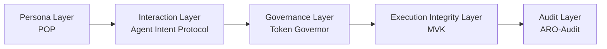

<!-- language-switch:start -->
[English](./README.md) | [中文](./README.zh-CN.md)
<!-- language-switch:end -->

# 张斌

Independent researcher building the Digital Biosphere Architecture and Agent Evidence Profile for governable, replay-verifiable, and audit-ready AI agents.

## Role

我的当前研究主线，是围绕 persona、interaction、governance、execution integrity 和 audit 五层来组织日益自治的 AI 系统。

这个首页是研究索引页，不是单一 agent 产品主页。公开表面围绕一条统一主线展开：architecture hub + execution-evidence entry。

## Dual entry

- [digital-biosphere-architecture](https://github.com/joy7758/digital-biosphere-architecture) = canonical architecture hub
- [agent-evidence](https://github.com/joy7758/agent-evidence) = concrete execution-evidence entry

## For architecture readers

- 先从 [digital-biosphere-architecture](https://github.com/joy7758/digital-biosphere-architecture) 进入，理解系统视角、仓库角色和五层地图。
- 如果你需要看某一层的定义，再进入相应的 layer repo。

## For evidence readers

- [agent-evidence](https://github.com/joy7758/agent-evidence) 看具体的 execution-evidence package 和离线验证路径
- [verifiable-agent-demo](https://github.com/joy7758/verifiable-agent-demo) 看最短 walkthrough
- [aro-audit](https://github.com/joy7758/aro-audit) 看 audit control plane 和 post-execution review

## Core layer repos

- [persona-object-protocol](https://github.com/joy7758/persona-object-protocol) = persona layer
- [agent-intent-protocol](https://github.com/joy7758/agent-intent-protocol) = interaction layer
- [token-governor](https://github.com/joy7758/token-governor) = governance layer
- [fdo-kernel-mvk](https://github.com/joy7758/fdo-kernel-mvk) = execution-integrity layer
- [aro-audit](https://github.com/joy7758/aro-audit) = audit layer

## Supporting Annexes

- [agent-object-protocol](https://github.com/joy7758/agent-object-protocol) 提供相邻互操作性和支持协议工作。
- [agent-governance-benchmark](https://github.com/joy7758/agent-governance-benchmark) 提供评估场景和指标。
- [docs/profile-bio-finalists.md](./docs/profile-bio-finalists.md) 保留简短 bio 页面。

首页继续省略各类薄适配器和实现特定集成。

## Legacy Lineage

- [pFDO-规范](https://github.com/joy7758/pFDO-Specification) — 早期 DPP 工作的历史背景，而不是当前的核心堆栈。
- [redrock-opendpp-core](https://github.com/joy7758/redrock-opendpp-core) — DPP 实现工作的先前沿袭，而不是当前的核心堆栈。
- [MCP-Legal-China](https://github.com/joy7758/MCP-Legal-China) — 相邻法律/工具工作的历史背景，而不是当前的核心堆栈。
- [Kinetic-Robotics-FDO-Sovereignty](https://github.com/joy7758/Kinetic-Robotics-FDO-Sovereignty) — 主权/K-RFS 探索的历史背景，而不是当前的核心堆栈。
- [AASP-Core](https://github.com/joy7758/AASP-Core) — 先前的沿袭仓库，而不是当前的核心堆栈。
- [ISAS-Core](https://github.com/joy7758/ISAS-Core) — 先前的沿袭仓库，而不是当前的核心堆栈。
- [edo-architecture-index](https://github.com/joy7758/edo-architecture-index) — 历史索引材料，而不是当前的核心堆栈。

## 五层地图

```mermaid
flowchart LR
    Persona["Persona Layer<br>POP"] --> Interaction["Interaction Layer<br>Agent Intent Protocol"]
    Interaction --> Governance["Governance Layer<br>Token Governor"]
    Governance --> Execution["Execution Integrity Layer<br>MVK"]
    Execution --> Audit["Audit Layer<br>ARO-Audit"]
```

|层 |仓库 |
| --- | --- |
|角色| `persona-object-protocol` |
|互动| `agent-intent-protocol` |
|治理| `token-governor` |
|执行诚信 | `fdo-kernel-mvk` |
|审计| `aro-audit` |

支持证据基材：`agent-evidence`

演练演示：`verifiable-agent-demo`

## 研究方向

- 协议化数字对象
- 运行时治理
- 可重放验证的执行完整性
- 审计准备证据和审查

## 身份/链接

- [ORCID](https://orcid.org/0009-0002-8861-1481)
- [数字生物圈架构](https://github.com/joy7758/digital-biosphere-architecture)
- [角色对象协议](https://github.com/joy7758/persona-object-protocol)
- [智能体意图协议](https://github.com/joy7758/agent-intent-protocol)
- [代币监管者](https://github.com/joy7758/token-governor)
- [fdo-内核-mvk](https://github.com/joy7758/fdo-kernel-mvk)
- [aro-审计](https://github.com/joy7758/aro-audit)

## 地位

- 公共研究面
- 主动整合中的五层堆栈
- 为沿袭保留的遗留仓库，而不是作为主要入口点

<!-- profile-render-refresh -->
<!-- render-refresh: 20260323T000000Z -->
